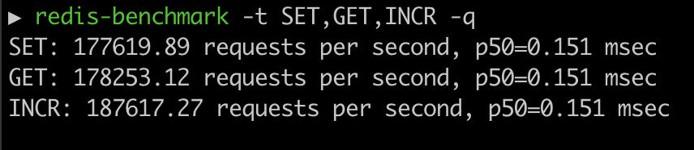

# A Lite redis-server implementation in golang

### Prerequisites

- Go 1.22 or later
- redis-cli (for testing this implementation)
  
  Installation guide - https://redis.io/docs/install/install-redis/

#### Try out

```bash
# Using brew
brew install omkarph/tap/redis-server-lite
redis-server-lite

# or

# Using release archvies
wget https://github.com/OmkarPh/test-redis-server-lite/releases/download/v0.0.1-test-actions-9/redis-server-lite_0.0.1-test-actions-9_darwin_amd64.tar.gz
mkdir redis-server-lite
tar -xf redis-server-lite_0.0.1-test-actions-9_darwin_arm64.tar.gz -C redis-server-lite
cd redis-server-lite
./redis-server-lite
```


#### Local setup

```bash
# Clone this repository
git clone https://github.com/OmkarPh/redis-lite.git
cd redis-lite

# Run the server
go run .

# Build release executible
go build -o build/redis-lite-server -v
```

## Implemented redis-cli commands

| Command 	| Syntax            	| Example                      	|   	|
|---------	|-------------------	|------------------------------	|---	|
| SET     	| SET <key> <value> 	| redis-cli SET name omkar      	|   	|
| GET     	| GET <key>         	| redis-cli GET name           	|   	|
| DEL    	| DEL key [key ...]           	| redis-cli DEL name<br/>redis-cli DEL name age           	|   	|
| INCR    	| INCR key          	| redis-cli INCR age           	|   	|
| DECR    	| DECR key          	| redis-cli DECR age           	|   	|
| EXISTS    	| EXISTS key [key ...]           	| redis-cli EXISTS name<br/>redis-cli EXISTS name age           	|   	|
| EXPIRE    	| EXPIRE key seconds [NX / XX / GT / LT]         	| redis-cli EXPIRE name 20<br/>redis-cli EXPIRE name 20 NX           	|   	|
| PERSIST    	| PERSIST key         	| redis-cli PERSIST name           	|   	|
| TTL    	| TTL key          	| redis-cli TTL key           	|   	|
| TYPE    	| TYPE key          	| redis-cli TYPE name           	|   	|
| PING    	| PING              	| redis-cli PING               	|   	|
| ECHO    	| ECHO <message>    	| redis-cli ECHO "Hello world" 	|   	|

## Benchmarks

#### redis-server-lite


#### Original redis-server

