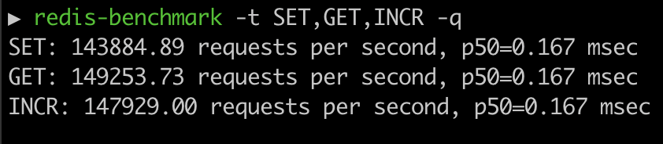
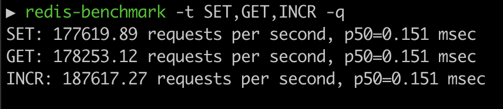

## A Lite redis-server implementation in golang

## Prerequisites
- redis-cli (for testing the implementation)
  
  Installation guide - https://redis.io/docs/install/install-redis/

## Try out

```bash
# Using brew (for mac or linux)
brew install omkarph/tap/redis-server-lite
redis-server-lite

# or

# Using a release archive from https://github.com/OmkarPh/redis-server-lite/releases/latest
cd ~/Downloads # Go to the Downloads folder of your machine
mkdir redis-server-lite
tar -xf "release_archive_file" -C redis-server-lite
cd redis-server-lite
./redis-server-lite

# Test
redis-cli set message Hello World
redis-cli get message
```

## Features

- Follows RESP protocol (Works with redis-cli & redis-benchmark)
- Key expiration (Active & Passive)
- Simple & Sharded key-value stores
  
  Can be customised in `redis.conf` file as:
  ```
  kv_store sharded
  shardfactor 32

  or

  kv_store simple
  ```

## Supported commands

Detailed documentation - https://redis.io/commands/

| Command  | Syntax                                   | Example                                                   | Description                                     |
|----------|------------------------------------------|-----------------------------------------------------------|-------------------------------------------------|
| SET      | SET <key> <value>                        | redis-cli SET name omkar                                  | Set the string value of a key                   |
| GET      | GET <key>                                | redis-cli GET name                                        | Get the value of a key                          |
| DEL      | DEL key [key ...]                        | redis-cli DEL name<br/>redis-cli DEL name age             | Delete one or more keys                         |
| INCR     | INCR key                                 | redis-cli INCR age                                        | Increment the integer value of a key            |
| DECR     | DECR key                                 | redis-cli DECR age                                        | Decrement the integer value of a key            |
| EXISTS   | EXISTS key [key ...]                     | redis-cli EXISTS name<br/>redis-cli EXISTS name age       | Check if a key exists                           |
| EXPIRE   | EXPIRE key seconds [NX / XX / GT / LT]   | redis-cli EXPIRE name 20<br/>redis-cli EXPIRE name 20 NX  | Set a key's time to live in seconds             |
| PERSIST  | PERSIST key                              | redis-cli PERSIST name                                    | Remove the expiration from a key                |
| TTL      | TTL key                                  | redis-cli TTL key                                         | Get the time to live for a key (in seconds)     |
| TYPE     | TYPE key                                 | redis-cli TYPE name                                       | Determine the type stored at a key              |
| PING     | PING                                     | redis-cli PING                                            | Ping the server                                 |
| ECHO     | ECHO <message>                           | redis-cli ECHO "Hello world"                              | Echo the given string                           |


## Benchmarks

```bash
redis-benchmark -t SET,GET,INCR -q
```

### redis-server-lite


### Original redis-server

